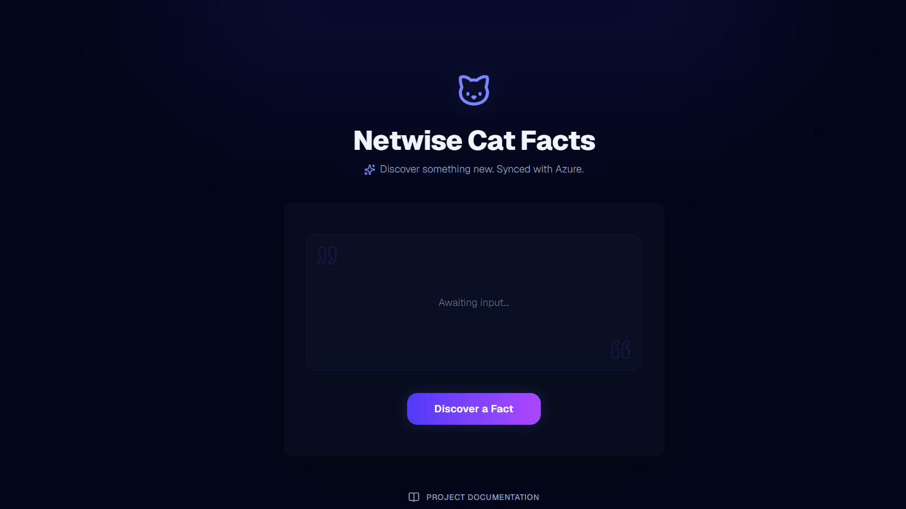
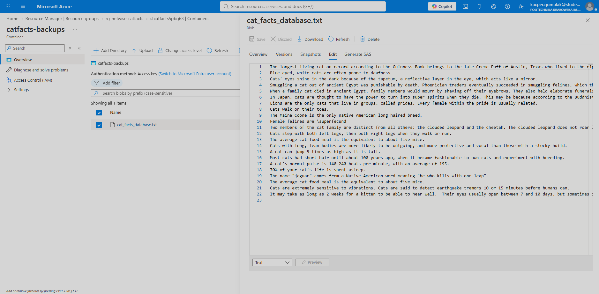
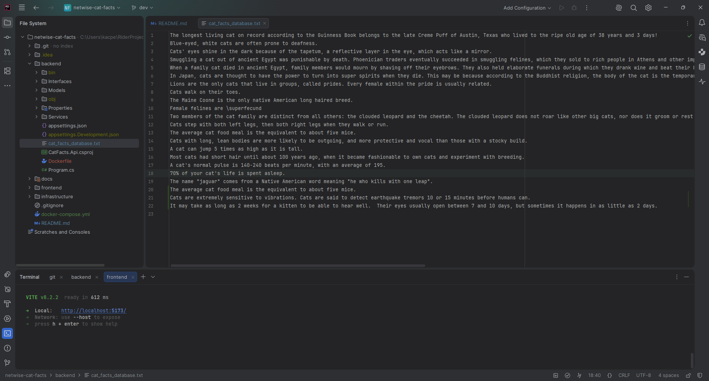

# 🐱 Netwise Cat Facts: Cloud Application

<div>
    
    
    
    
    
    
</div>

<br />

A modern, full-stack web application designed to fetch, locally persist, and safely back up random cat facts to **Microsoft Azure Cloud**. Built to demonstrate cloud-native engineering, concurrent file I/O operations, Infrastructure as Code (IaC), and modern frontend architectural patterns.



---

## ✨ Key Business & Technical Features

### ☁️ Cloud & Infrastructure (DevOps)
* **Automated Azure Backups:** Every fetched fact is written to a local `.txt` database and immediately synchronized with an **Azure Blob Storage** container using `Azure.Storage.Blobs`.
* **Infrastructure as Code (IaC):** Azure resources (Resource Group, Storage Account, Blob Container, random suffix generation) are provisioned entirely via **Terraform**.
* **Containerization:** The application is fully containerized using **Docker Compose** with multi-stage builds. The frontend is served via an ultra-lightweight **Nginx** container, while the backend runs on a dedicated .NET 9 ASP.NET Core runtime.

### ⚙️ Backend Architecture (.NET 9 Minimal API)
* **Thread-Safe I/O Operations:** Implemented `SemaphoreSlim` to ensure 100% thread safety and prevent file locking exceptions during concurrent write operations to the local text file.
* **Typed HttpClient:** Centralized external API communication using the modern Typed HttpClient pattern to prevent socket exhaustion and encapsulate configurations.
* **Clean Architecture Principles:** Services are strictly separated through interfaces (`IFileStorage`, `ICloudBackupService`, `ICatFactProvider`) injected via the native .NET Dependency Injection (DI) container.
* **Fail-Safe Logic:** Graceful degradation implemented—if Azure credentials are missing or incorrect, the app logs a warning, saves the fact locally, and proceeds without crashing.

### 🎨 Frontend Experience (React 18 + Vite)
* **State & Async Management:** Eliminated `useEffect` data fetching by implementing **TanStack Query (React Query)** combined with **Axios** for robust caching, loading states, and error handling.
* **Modern UI & Tailwind v4:** Fully responsive, dark-mode aesthetic utilizing the newest Tailwind CSS v4 `@theme inline` features, frosted glass effects (Glassmorphism), and highly customized UI components via **shadcn/ui**.
* **Advanced CSS Animations:** Implemented a dynamic, staggered wave animation for the title and interactive elements that react to user interactions.
* **UX/UI Details:** Elegant toast notifications via `sonner` and custom-built hidden scrollbars for displaying overly long fetched data without breaking the layout.

---

## 🏗️ System Architecture

*Automated backup synchronization with Azure Blob Storage.*


<details>
<summary><b>📂 Click to view the full Project Directory Structure</b></summary>

```text
netwise-cat-facts/
├── backend/                        # .NET 9 Web API
│   ├── Controllers/
│   ├── Interfaces/                 # DI Contracts
│   ├── Services/                   # Cloud Backup, File Storage, Cat API Provider
│   ├── Program.cs                  # Minimal API endpoints & CORS
│   └── Dockerfile                  # Multi-stage .NET build
├── frontend/                       # React SPA
│   ├── src/
│   │   ├── components/ui/          # shadcn components
│   │   ├── lib/                    # Axios API client setup
│   │   ├── App.tsx                 # Main application logic & animations
│   │   ├── index.css               # Tailwind v4 configuration
│   │   └── main.tsx                # TanStack Query & Toaster providers
│   ├── nginx.conf                  # Custom Nginx routing configuration
│   └── Dockerfile                  # Multi-stage Node.js + Nginx build
├── infrastructure/                 # IaC
│   └── main.tf                     # Terraform script for Azure Resources
├── docker-compose.yml              # Container orchestration
└── README.md
```
</details>

## 🚀 Quick Start (One-Click Deployment)

This project is configured to run flawlessly on any system with Docker installed.

**1. Prerequisites**  
- Docker & Docker Compose
- An active Microsoft Azure subscription (if you wish to test cloud backups).

**2. Configuration**
1. Clone the repository:

```bash
git clone https://github.com/zephir-x/netwise-cat-facts.git
cd netwise-cat-facts
```

2. Navigate to the backend directory and configure your Azure Connection String.

```bash
cd backend
```

3. Open `appsettings.Development.json` (or set the environment variable in docker-compose) and input your Azure Storage Account connection string:

```json
"ConnectionStrings": {
"AzureStorage": "DefaultEndpointsProtocol=https;AccountName=YOUR_ACCOUNT;AccountKey=YOUR_KEY;EndpointSuffix=core.windows.net"
}
```

*(Note: The app runs perfectly without Azure credentials. It will simply save the data locally to `cat_facts_database.txt` and log a graceful skip message for the cloud sync).*

**3. Build & Run**
From the root directory, simply run:

```bash
docker compose up -d --build
```

**4. Access the Application**  
- Frontend UI: Open your browser and navigate to `http://localhost:5173`
- Backend API (Direct Access): `http://localhost:5041/api/facts/random`

*Local database file `cat_facts_database.txt` securely appended via SemaphoreSlim.*


## 💡 Easter Egg
Make sure to hover over the glowing cat icon in the UI and click it to discover a hidden interaction! 🐾

**Author**  
Designed and developed by **Kacper Gumulak** - [zephir-x](https://github.com/zephir-x).  
Connect with me on [LinkedIn](https://www.linkedin.com/in/kacper-gumulak-dev/) or check out my [Portfolio](https://kacpergumulak.pl).